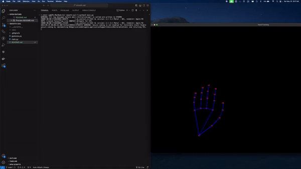

# Smooth Sail
This project uses MediaPipe, OpenCV, and PyAutoGUI to perform real-time hand gesture recognition and control the mouse cursor based on recognized gestures. It is designed to provide a touchless interface for controlling a computer.

# Features
- Real-time Hand Tracking: Uses MediaPipe to detect and track hand landmarks in real-time.
- Gesture Recognition: Classifies gestures based on hand landmarks.
- Mouse Control: Controls the mouse cursor and performs click actions based on recognized gestures.
  
#Installation
1. Clone the Repository

```bash
git clone https://github.com/your-username/hand-gesture-control.git
cd hand-gesture-control
```

2. Install Dependencies
```bash
pip install -r requirements.txt
Ensure OpenCV is Installed

```bash
pip install opencv-python
```

3. Ensure MediaPipe is Installed
```bash
pip install mediapipe
```

4. Install PyAutoGUI
```bash
pip install pyautogui
```

# Usage
1. Run the Script
```bash
python main.py
```
2. Gesture Actions
- Single Tap: Left mouse click.
- Single Middle Tap: Right mouse click.
- Single Tap and Hold: Left mouse click and hold.

## Demo

  
# Contributing
1. Fork the Repository
2. Create a Feature Branch
```bash
git checkout -b feature/YourFeature
```
3. Commit Your Changes
```bash
git commit -m 'Add some feature'
```
4. Push to the Branch
```bash
git push origin feature/YourFeature
```

5. Open a Pull Request

# License
This project is licensed under the MIT License. See the LICENSE file for details.